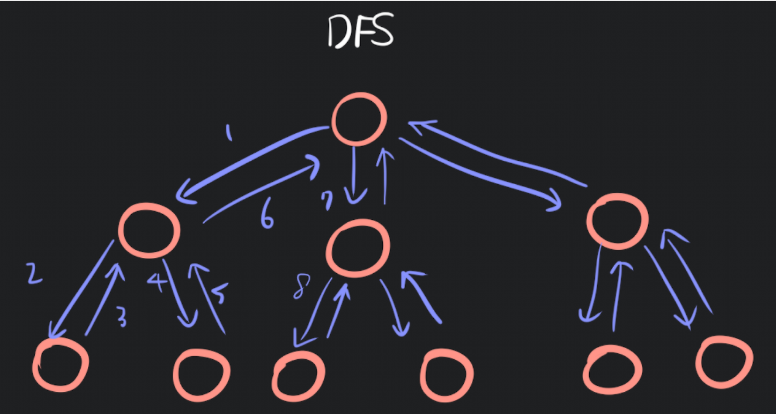
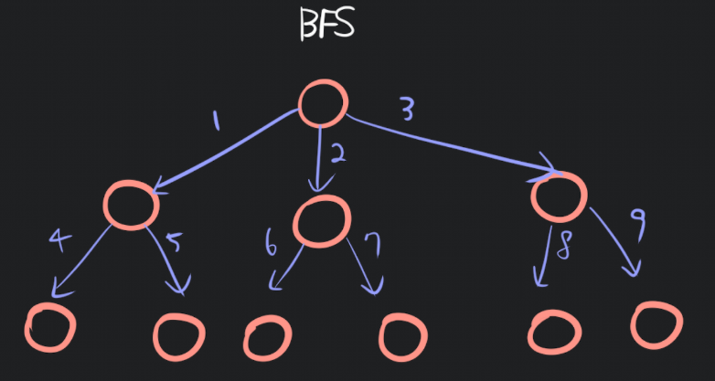

## DFS 깊이 우선 탐색
루트 노드(혹은 다른 임의의 노드)에서 시작해서 다음 분기로 넘어가기 전에 해당 분기를 완벽하게 탐색하는 방식을 말한다.

## DFS 응용
+ 탐색 경로: 미로 찾기 및 퍼즐 문제 등에서 특정 목표 지점에 도달하는 경로 탐색
+ 백트래킹 문제: 조합, 순열 생성 등에서 백트래킹 기법과 함께 활용
+ 사이클 탐지: 그래프에서 사이클이 존재하는지 검사
+ 강한 연결 요소 찾기: 타잔(Tarjan) 알고리즘으로 강한 연결 요소를 찾을 수 있음

## BFS 너비 우선 탐색
루트 노드(혹은 다른 임의의 노드)에서 시작해서 인접한 노드를 먼저 탐색하는 방법으로,
시작 정점으로부터 가까운 정점을 먼저 방문하고 멀리 떨어져 있는 정점을 나중에 방문하는 순회 방법이다.

## BFS 응용
+ 최단 경로 찾기 : 가중치가 없는 그래프에서 시작 - 목표까지의 최단 경로를 찾는데 사용한다.
+ 레벨별 노드 탐색 : 특정 레벨에 따라 탐색 적합하다.

## DFS와 BFS 비교

| DFS (깊이우선탐색) | BFS (너비우선탐색) |
|-------------------|-------------------|
| 현재 정점에서 갈 수 있는 점들까지 들어가면서 탐색 | 현재 정점에 연결된 가까운 점들부터 탐색 |
| 스택 또는 재귀함수로 구현 | 큐를 이용해서 구현 |

## DFS와 BFS의 시간 복잡도
| 알고리즘           | 시간복잡도    |
| -------------- | -------- |
| DFS (깊이 우선 탐색) | O(V + E) |
| BFS (너비 우선 탐색) | O(V + E) |
+ V (Vertex): 정점 개수
+ E (Edge): 간선 개수

둘 다 모든 정점과 간선을 한 번씩 확인하기 때문에 동일합니다.