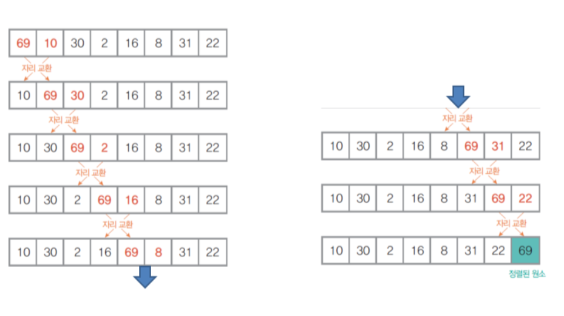
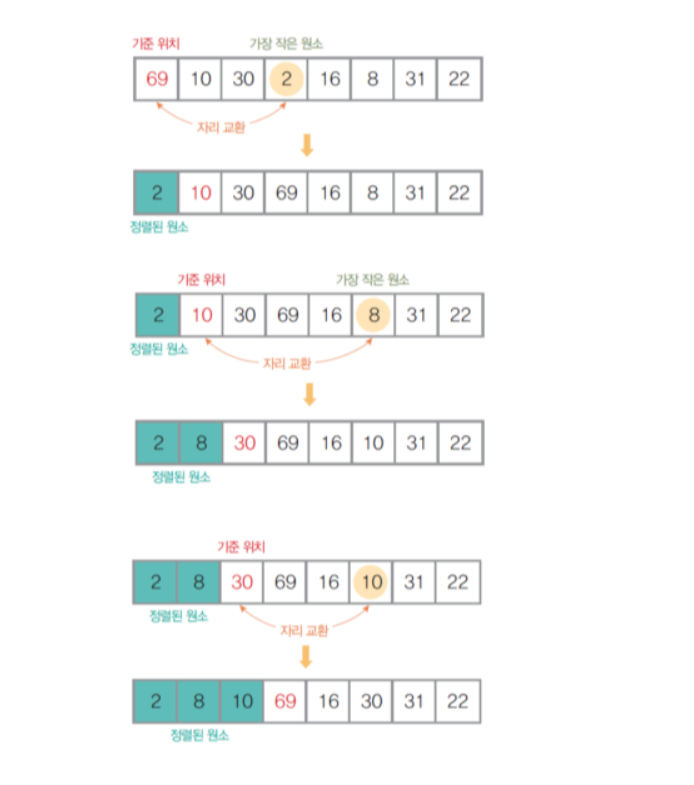
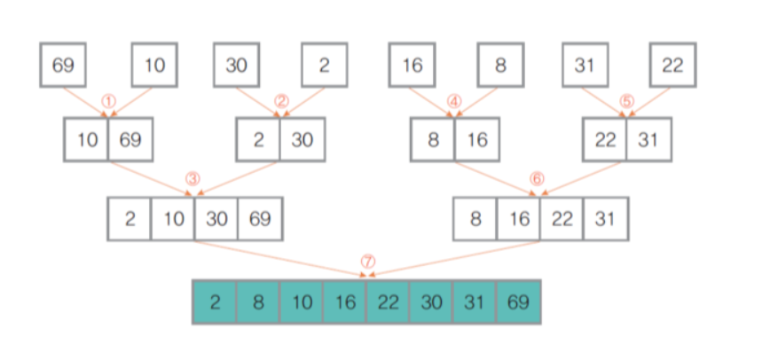
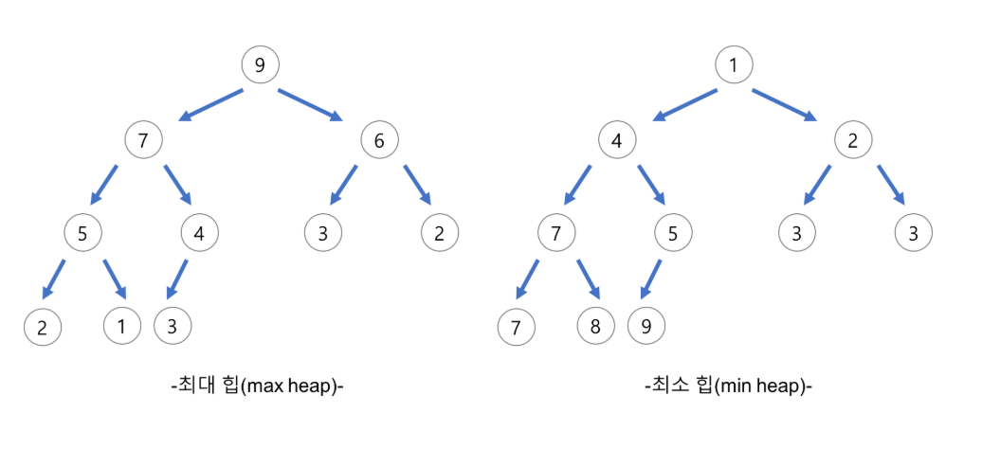
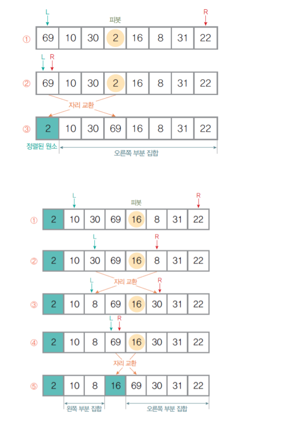

## 버블 정렬

+ 비교 기반 정렬, 교환 방식
+ 인접한 두 원소를 비교, 자리를 교환하는 방식
+ 끝(가장 큰 값)에서부터 채워짐
```python
# array = [8,4,6,2,9,1,3,7,5]
array = [9,8,7,6,5,4,3,2,1]

def bubble_sort(array):
    n = len(array)
    for i in range(n - 1):
        for j in range(n - i - 1):
            if array[j] > array[j + 1]:
                array[j], array[j + 1] = array[j + 1], array[j]
        print(array)

print("before: ",array)
bubble_sort(array)
print("after:", array)
```
## 선택 정렬

+ 비교 기반 정렬, 교환 방식
+ 전체 원소들 중에서 기준 원소를 선택, 교환하는 방식
+ 앞(가장 작은 값)에서부터 채워짐
```python
array = [8,4,6,2,9,1,3,7,5]

def selection_sort(array):
	n = len(array)
	for i in range(n):
		min_index = i
		for j in range(i + 1, n):
			if array[j] < array[min_index]:
				min_index = j
		array[i], array[min_index] =  array[min_index], array[i]
		print(array[:i+1])

print("before: ",array)
selection_sort(array)
print("after:", array)
```
## 삽입 정렬

+ 비교 기반 정렬, 삽입 방식
+ 정렬된 부분 집합에 정렬할 새 원소의 위치를 찾아 삽입
+ 전체 원소를 정렬된 부분 집합과 정렬되지 않은 부분 집합으로 분할
```python
array = [8,4,6,2,9,1,3,7,5]

def insertion_sort(array):
	n = len(array)
	for i in range(1, n):
		for j in range(i, 0, - 1):
			if array[j - 1] > array[j]:
				array[j - 1], array[j] = array[j], array[j - 1]
		print(array[:i+1])

print("before: ",array)
insertion_sort(array)
print("after:", array)
```
## 병합 정렬

+ 비교 기반 정렬, divide & conquer 방식
+ 정렬 대상을 먼저 쪼갠 뒤 각각을 정렬
+ 정렬된 부분 집합들을 하나로 결합
```python
array = [8,4,6,2,9,1,3,7,5]

def merge_sort(array):
	if len(array) < 2:
		return array
	mid = len(array) // 2
	low_arr = merge_sort(array[:mid])
	high_arr = merge_sort(array[mid:])

	merged_arr = []
	l = h = 0
	while l < len(low_arr) and h < len(high_arr):
		if low_arr[l] < high_arr[h]:
			merged_arr.append(low_arr[l])
			l += 1
		else:
			merged_arr.append(high_arr[h])
			h += 1
	merged_arr += low_arr[l:]
	merged_arr += high_arr[h:]
	print(merged_arr)
	return merged_arr

print("before: ",array)
array = merge_sort(array)
print("after:", array)
```
## 힙 정렬

+ 비교 기반 정렬, 트리 방식
+ 정렬 대상 원소들을 Heap Tree에 삽입
+ Heap Tree의 root를 꺼내와 순서대로 나열
```python
array = [8,4,6,2,5,1,3,7,9]

def heapify(arr, n, i):
    largest = i
    left = 2 * i + 1
    right = 2 * i + 2

    if left < n and arr[left] > arr[largest]:
        largest = left

    if right < n and arr[right] > arr[largest]:
        largest = right

    if largest != i:
        arr[i], arr[largest] = arr[largest], arr[i]
        heapify(arr, n, largest)

def heap_sort(arr):
    n = len(arr)

    for i in range(n // 2 - 1, -1, -1):
        heapify(arr, n, i)

    for i in range(n - 1, 0, -1):
        arr[0], arr[i] = arr[i], arr[0]
        heapify(arr, i, 0)

    return arr

print("before:", array)
sorted_array = heap_sort(array)
print("after:", sorted_array)
```
## 퀵 정렬

+ 비교 기반 정렬, divide & conquer 방식
+ 피벗을 중심으로 왼쪽, 오른쪽 부분 집합을 분할
+ 왼쪽에는 피벗보다 작은 원소를, 오른쪽에는 피벗보다 큰 원소를 이동
```python
array = [8,4,6,2,5,1,3,7,9]

def quick_sort(array):
	if len(array) <= 1:
		return array
	pivot = len(array) // 2
	front_arr, pivot_arr, back_arr = [], [], []
	for value in array:
		if value < array[pivot]:
			front_arr.append(value)
		elif value > array[pivot]:
			back_arr.append(value)
		else:
			pivot_arr.append(value)
	print(front_arr, pivot_arr, back_arr)
	return quick_sort(front_arr) + quick_sort(pivot_arr) + quick_sort(back_arr)

print("before: ",array)
array = quick_sort(array)
print("after:", array)
```