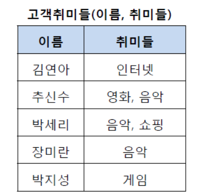
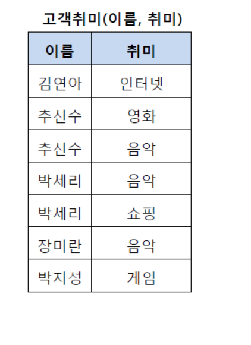
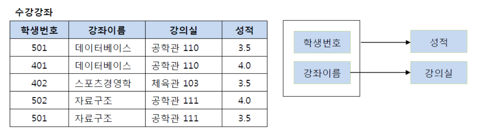
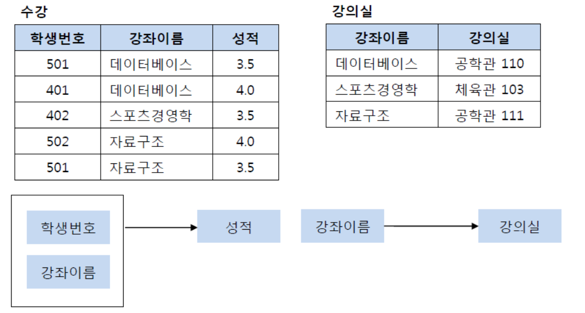
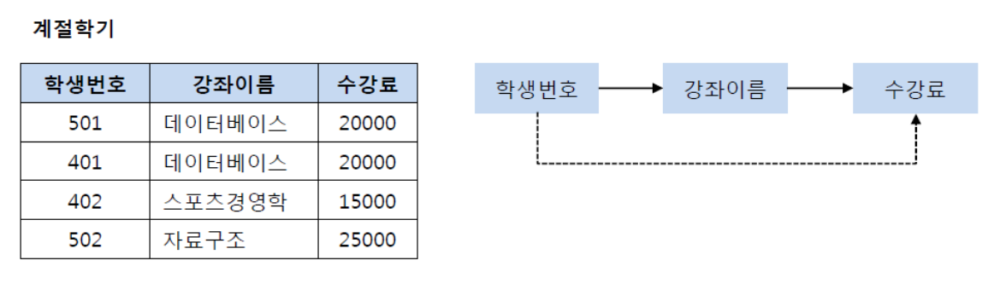
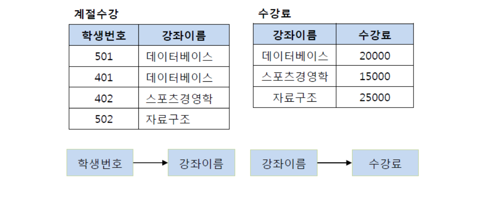
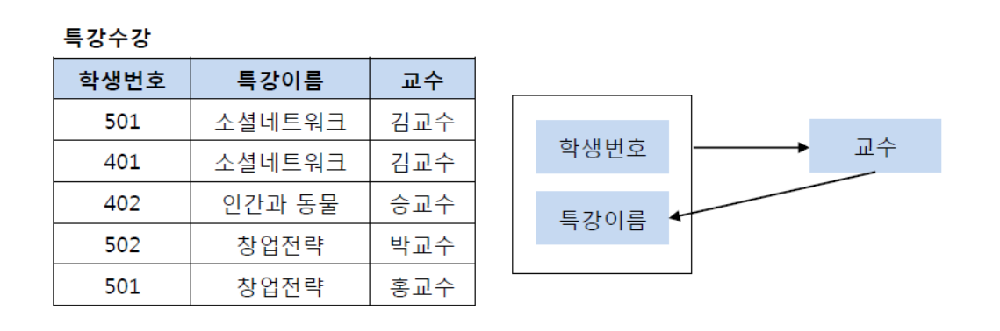
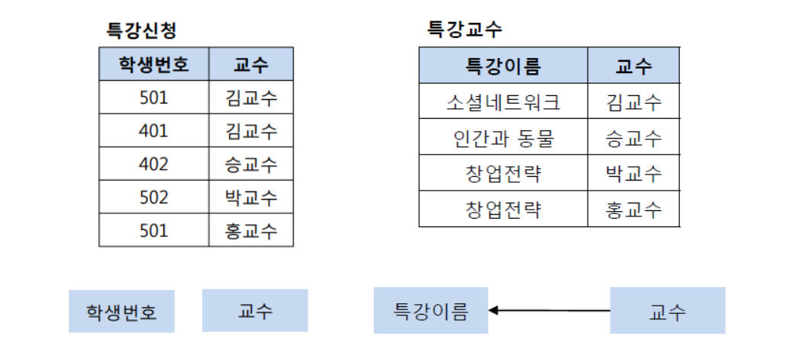

## 정규화
정규화는 테이블간의 **중복데이터를 허용하지 않는다는 것**이다.\
중복된 데이터를 허용하지 않음으로써 무결성을 유지할 수 있고, DB의 저장용량도 줄일 수 있다.

## 제1 정규화
제1 정규화는 테이블의 컬럼이 원자값을 갖도록 테이블을 분해하는 것이다.

위에서 아래로 변한다.

## 제2 정규화
제1 정규화를 진행한 테이블에 대해 완전 함수 종속을 만족하도록 테이블을 분해하는 것이다.
+ 완전 함수 종속이라는 것은 기본키의 부분집합이 결정자가 되어선 안된다는 것을 의미한다.

위에서 아래로 변한다.

## 제3 정규화
제3 정규화란 제2 정규화를 진행한 테이블에 대해 이행적 종속을 없애도록 테이블을 분해하는 것이다.
+ 여기서 이행적 종속이라는 것은 A -> B , B -> C가 성립할 때 A -> C가 성립되는 것을 의미한다.

위에서 아래로 변한다.

## BCNF 정규화
BCNF 정규화란 제3 정규화를 진행한 테이블에 대해 모든 결정자가 후보키가 되도록 테이블을 분해하는 것이다.

위에서 아래로 변한다.
