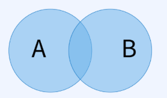
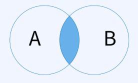

## 집합연산자
집합연산자는 두 테이블에 대한 집합 연산(합집합, 교집합 등)을 수행하는 연산자

## UNION ALL / UNION
\
**합집합 연산**을 수행한다.\
중복된 레코드들을 중복된 개수만큼 그대로 포함시키는 것이 **UNION ALL**\
중복 레코드를 하나만 포함시키는 것이 **UNION**\
**주의할 점** : UNION을 실행하면 한쪽 테이블 내에서의 **중복까지 제거**된다는 점

## INTERSECT
\
교집합 연산을 수행. 두 테이블에 공통적으로 포함된 레코드만 포함시킨다.

## MINUS /  EXCEPT
차집합 연산을 수행한다. 왼쪽 테이블에서 두 테이블에 공통적으로 포함된 레코드들을 제외시킨 결과를 반환한다.\
왼쪽 테이블에서 오른쪽 테이블을 제외한 결과 출력