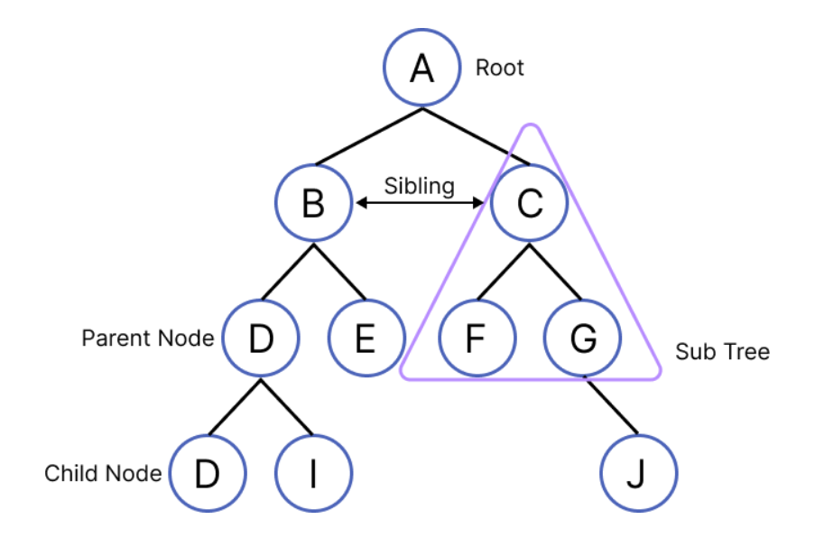
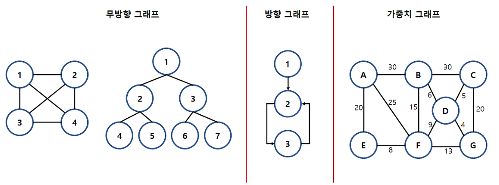

## 트리(Tree)
**트리(Tree)**는 그래프의 한 종류로,
하나의 루트(Root)를 기준으로 계층적으로 연결된 비선형 자료구조이다.
+ 각 노드는 부모 → 자식 관계를 가지며 사이클(Cycle)이 존재하지 않는 연결 그래프이다.
+ 두 노드 사이의 경로는 항상 하나뿐
+ 즉, 조직도·폴더 구조처럼 위에서 아래로 내려가는 구조를 표현할 때 사용된다.
## 구성요소

+ ```노드(Node)``` : 트리 구조를 이루는 모든 개별 데이터
+ ```루트(Root)``` : 트리 구조의 시작점이 되는 노드
+ ```부모 노드(Parent node)``` : 두 노드가 상하관계로 연결되어 있을 때 상대적으로 루트에서 가까운 노드
+ ```자식 노드(Child node)``` : 두 노드가 상하관계로 연결되어 있을 때 상대적으로 루트에서 먼 노드
+ ```리프(Leaf)``` : 트리 구조의 끝 지점이고, 자식 노드가 없는 노드

## 특징
+ 노드 개수가 N개면 간선은 **항상 N-1개**
+ 계층 구조 표현에 최적화
+ 탐색 방식: ```DFS / BFS```

## Graph
**그래프(Graph)** 는 정점(Vertex)과 간선(Edge)을 이용해 객체 간의 관계를 표현하는 자료구조이다.
+ 트리보다 자유로운 구조
+ 사이클 가능
+ 방향 / 무방향 모두 가능


+ ```정점(Vertex)```: 데이터를 담는 노드
+ ```간선(Edge)```: 정점 간의 연결
+ ```인접 정점(Adjacent Vertex)```: 간선으로 직접 연결된 정점
+ ```가중치 그래프(Weighted Graph)```: 간선에 비용/거리 존재
+ ```비가중치 그래프(Unweighted Graph)```: 비용 없음
+ ```무방향 그래프(Undirected)```: 양방향 이동 가능
+ ```방향 그래프(Directed)```: 단방향 이동
+ ```진입차수(In-degree)```: 들어오는 간선 수
+ ```진출차수(Out-degree)```: 나가는 간선 수
+ ```사이클(Cycle)```: 시작 정점으로 다시 돌아오는 경로
+ ```자기 루프(Self Loop)```: 자기 자신으로 향하는 간선

## 특징
+ 복잡한 관계 표현 가능
+ 여러 경로 존재 가능
+ 트리는 그래프의 특수한 형태
## 구현
```python
# 트리
class TreeNode:
    def __init__(self, data):
        self.data = data
        self.children = []

# 트리 구조
#        A
#      /   \
#     B     C
#    /
#   D
root = TreeNode("A")
b = TreeNode("B")
c = TreeNode("C")
d = TreeNode("D")

root.children.append(b)
root.children.append(c)
b.children.append(d)

def dfs_tree(node):
    print(node.data, end=" ")
    for child in node.children:
        dfs_tree(child)

dfs_tree(root)
```
```python
# 그래프
graph = {
    1: [2, 3],
    2: [1, 4],
    3: [1],
    4: [2]
}

def dfs_graph(v, visited):
    visited.add(v)
    print(v, end=" ")

    for nv in graph[v]:
        if nv not in visited:
            dfs_graph(nv, visited)

visited = set()
dfs_graph(1, visited)
```